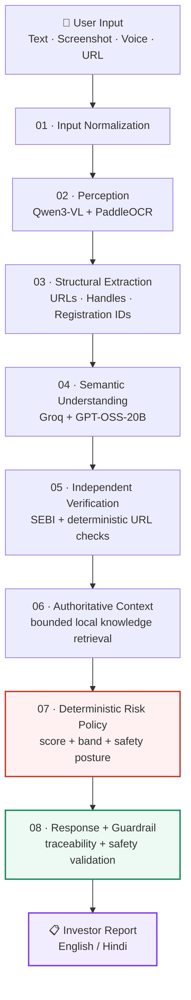

<div align="center">

# 🛡️ PARAKH AI

### **Pause • Verify • Then Trade**

**AI-powered investor safety for Bharat**

### ✨ [Launch the Interactive PARAKH AI Experience](https://newtonspaxe-source.github.io/SANGYAN_TEAM_ORION/)


Detect suspicious financial content. Understand the red flags. Verify what matters. Take safer next steps.

<br/>

[](#-sangyan-alignment)
[](#-sangyan-alignment)
[](#-sangyan-alignment)
[](#-sangyan-alignment)

<br/>

**🇬🇧 English &nbsp; • &nbsp; 🇮🇳 Hindi &nbsp; • &nbsp; 💬 Text &nbsp; • &nbsp; 🖼️ Screenshot &nbsp; • &nbsp; 🎙️ Voice**

</div>

---

## 🎯 What is PARAKH AI?

Financial scams rarely arrive looking like a scam.

They arrive as a Telegram message, WhatsApp forward, social-media screenshot, suspicious investment link, guaranteed-return promise, impersonation attempt, or a message designed to create urgency.

**PARAKH AI** puts a safety layer between **seeing financial content** and **acting on it**.

The user can submit a message, screenshot, URL, or voice query. PARAKH turns that input into an explainable investigation:

```text
UNDERSTAND
    ↓
EXTRACT
    ↓
IDENTIFY RED FLAGS
    ↓
VERIFY
    ↓
APPLY DETERMINISTIC RISK POLICY
    ↓
EXPLAIN
    ↓
PROTECT
```

> **Don't make the user trust the AI. Make the AI help the user verify.**

---

# 💡 The Problem

For first-time and emerging digital investors, the difficult question is often not **how to invest**, but **what to trust**.

A suspicious message can combine several signals:

| Signal | Typical pattern |
|---|---|
| 💰 Unrealistic return | “₹5,000 becomes ₹50,000 today” |
| ⏳ Urgency | “Only today / act immediately” |
| 💳 Upfront fee | “Pay a processing fee to release your money” |
| 📲 Private funnel | “DM me to join” |
| 🔗 Suspicious link | Unexpected or unclear destination |
| 🎭 Impersonation | Authority or identity claims without evidence |
| 📣 Promotion disguised as education | Teaching language used to push an action |
| 🪪 Missing credentials | No clear regulatory or organisational context |

A useful safety product should not simply say **“scam”** or **“safe”**.

It should help answer:

> **What looks suspicious? Why? What can be verified? What remains uncertain? What should I do next?**

---

# 🧭 The PARAKH User Journey

```text
┌─────────────────────────────────────────────────────────┐
│                     USER SEES A CLAIM                   │
│       Telegram · WhatsApp · Social Media · Website     │
└──────────────────────────┬──────────────────────────────┘
                           │
                           ▼
┌─────────────────────────────────────────────────────────┐
│                        PARAKH                           │
│                                                         │
│    💬 Text   🖼️ Screenshot   🎙️ Voice   🔗 URL         │
└──────────────────────────┬──────────────────────────────┘
                           │
                           ▼
                  👁️ UNDERSTAND
                           │
                           ▼
                  🚩 IDENTIFY SIGNALS
                           │
                           ▼
                  🔎 VERIFY
                           │
                           ▼
                  🛡️ ASSESS RISK
                           │
                           ▼
                  🧠 EXPLAIN
                           │
                           ▼
                  ✅ PROTECT
```

The product is intentionally a **public-good investor-protection system**, not a trading assistant.

---

# 🏗️ System Architecture



The detailed engineering version is also documented in [`architecture`](https://github.com/newtonspaxe-source/SANGYAN_TEAM_ORION/blob/main/PARAKH_AI_ARCHITECTURE.png).

---

# 🔬 How PARAKH Works

## 01 · Input Normalization

The API accepts investigation content and converts it into a canonical internal state before model analysis.

Supported investigation forms include:

- text + optional question/context
- screenshot + optional question/context
- URL
- browser voice input, which is converted into text before analysis

---

## 02 · Multimodal Perception 👁️

Screenshots are processed through a dedicated observation layer.

### Qwen3-VL

```text
Qwen/Qwen3-VL-2B-Instruct
```

The model is used for observable visual perception such as:

- concise image captioning
- visible object identification
- localized visual information
- context that helps interpret a screenshot

The perception model does **not** produce the final fraud/risk decision.

### PaddleOCR

The production perception runtime uses PaddleOCR with these configured model families:

```text
PP-OCRv5_mobile_det
PP-OCRv5_mobile_rec
devanagari_PP-OCRv5_mobile_rec
```

The pipeline can therefore handle English/Latin screenshots as well as Devanagari-oriented OCR scenarios.

The project also contains the source experimentation notebook:

```text
notebooks_Qwen3VL_PaddleOCR.ipynb
```

---

## 03 · Structural Extraction 🧩

Important investigation entities are extracted from the normalized content:

```text
Message / Screenshot
        ↓
OCR + perception
        ↓
URLs
Handles
Registration identifiers
Claims / structured entities
        ↓
Canonical investigation context
```

This creates a stable hand-off between perception and semantic analysis.

---

## 04 · Semantic Intelligence 🧠

The production semantic provider is **Groq** with the configured default model:

```text
openai/gpt-oss-20b
```

The model is used to understand open-ended meaning such as:

- what the content is claiming
- which entities are involved
- semantic warning patterns
- observations and inferences
- content classification
- analysis summary
- education-oriented explanation
- safe next-action context

The model returns a structured local contract and the server validates it with Pydantic.

There is one semantic provider in the production path. The browser never receives the provider API key.

---

# 🛡️ The Most Important Architectural Choice

## The LLM understands. The policy decides.

PARAKH deliberately separates **semantic understanding** from **final risk calculation**.

```text
             LLM / Semantic Layer
                      │
                      ├── Claims
                      ├── Entities
                      ├── Signals
                      ├── Observations
                      └── Inferences
                              │
                              ▼
                   Deterministic Policy
                              │
          ┌───────────────────┼───────────────────┐
          │                   │                   │
     Risk signals       Verification        Evidence/context
          │                   │                   │
          └───────────────────┼───────────────────┘
                              ▼
                    Final risk assessment
```

This makes the safety layer:

- testable
- auditable
- predictable
- bounded independently of model wording

### Risk semantics

The displayed risk score is a **policy-calculated risk indicator**.

It is **not**:

- a probability of fraud
- a legal finding
- a guarantee that content is safe

The system deliberately preserves uncertainty.

```text
NOT_FOUND
   ≠
PROVEN FRAUD
```

---

# 🔎 Verification & Evidence

The production verification layer includes a read-only adapter for public **SEBI recognised-intermediary** pages and deterministic URL checks.

For supported registration identifiers, verification states remain explicit:

```text
VERIFIED
NOT_FOUND
UNABLE_TO_VERIFY
UNAVAILABLE
```

A `VERIFIED` registry result means the identifier was found in the checked official record. It does **not** mean every claim made by that entity is safe.

Likewise, `NOT_FOUND` or `UNAVAILABLE` is preserved as uncertainty rather than being converted into “fraud proven”.

---

# 🔐 Response Guardrails

The final response is validated after the risk engine.

The guardrail layer protects critical fields such as:

- risk score / risk level
- evidence identifiers
- verification statuses
- investor-protection wording

It also rejects unsafe output that attempts to become:

```text
❌ Investment advice
❌ Buy / Sell / Hold recommendation
❌ Price prediction
❌ Broker promotion
❌ Unsupported fraud certainty
❌ Fabricated evidence
❌ Unsupported regulatory approval claim
```

The implementation is documented in [`docs/security-and-guardrails.md`](docs/security-and-guardrails.md).

---

# 🌐 Bharat-First UX

PARAKH supports two presentation languages:

```text
🇬🇧 English
🇮🇳 हिन्दी
```

The important part is that **response language and source-content language are not assumed to be identical**.

Example:

```text
User language: Hindi 🇮🇳
Prompt: Hindi 🇮🇳
Screenshot: English 🇬🇧
              ↓
           PARAKH AI
              ↓
Explanation: Hindi 🇮🇳
```

This is important for real-world mixed-language financial messages.

---

# 🎙️ Voice Interaction

The frontend uses the browser speech APIs for input and output assistance.

```text
🎙️ User speaks
      ↓
SpeechRecognition / webkitSpeechRecognition
      ↓
Text prompt
      ↓
/analyze
      ↓
Investor-safety report
      ↓
speechSynthesis (optional)
```

Voice is a presentation/input convenience. The canonical investigation is still represented as structured text/state on the backend.

---

# 🚩 Example: Why the Signals Matter

### Input

> “You have received a ₹5 lakh government investment bonus. Pay ₹2,999 processing fees today and receive ₹5 lakh within 24 hours.”

### Investigation path

```text
Government / investment claim
          +
Upfront payment request
          +
Guaranteed large return
          +
Urgency
          ↓
Corroborated risk signals
          ↓
Deterministic risk policy
          ↓
Explain + verify + protect
```

The response should explain the observable warning signs and suggest safe verification steps rather than turning the system into an investment recommendation engine.

---

# 🧰 Technology Stack

## 🤖 AI / ML

| Technology | Purpose |
|---|---|
| 👁️ **Qwen/Qwen3-VL-2B-Instruct** | Visual perception |
| 🔤 **PaddleOCR 3.2.0** | Screenshot OCR |
| ⚡ **Groq API** | Semantic inference provider |
| 🧠 **openai/gpt-oss-20b** | Default semantic model |
| 🧾 **JSON + Pydantic** | Structured model-output contract |
| 🔥 **PyTorch** | Qwen runtime dependency |
| 🤗 **Transformers** | Qwen integration dependency |
| ⚙️ **Accelerate** | Model/runtime dependency |
| 🧩 **json-repair** | Model JSON repair support |

## ⚙️ Backend

| Technology | Purpose |
|---|---|
| 🐍 **Python 3.10+** | Core backend language |
| ⚡ **FastAPI** | HTTP API |
| 🚀 **Uvicorn** | ASGI server |
| 📐 **Pydantic 2.x** | Typed models and validation |
| 🔐 **python-dotenv** | Environment configuration |
| 🖼️ **Pillow** | Image handling |
| 📦 **python-multipart** | Multipart upload handling |

## ⚛️ Frontend

| Technology | Purpose |
|---|---|
| ⚛️ **React 19** | Product UI |
| ⚡ **Vite 8** | Development/build tooling |
| 🟨 **JavaScript** | Frontend logic |
| ⚛️ **JSX** | React components |
| 🎨 **CSS** | Interface styling |
| 🎙️ **Web Speech APIs** | Voice interaction |

## 🧪 Engineering

| Technology | Purpose |
|---|---|
| 🧪 **pytest** | Automated tests |
| 🌐 **httpx** | Test/client support |
| 📓 **Jupyter Notebook** | Qwen3-VL + PaddleOCR research/experimentation |
| 📦 **JSON** | Structured contracts and fixtures |
| 📝 **Markdown** | Documentation |
| 💠 **SVG / HTML** | Architecture and presentation assets |
| 💻 **PowerShell** | Local launch scripts |

> **Java is not part of the verified project stack.**

---

# 🗺️ Technology Map

```text
                            PARAKH AI
                                │
          ┌─────────────────────┼─────────────────────┐
          │                     │                     │
          ▼                     ▼                     ▼
      FRONTEND               BACKEND               AI / ML
          │                     │                     │
     React + Vite           Python              Qwen3-VL
     JSX / JS               FastAPI             PaddleOCR
     CSS                    Pydantic            Groq
     Web Speech             Uvicorn             GPT-OSS-20B
          │                     │                     │
          └─────────────────────┼─────────────────────┘
                                │
                                ▼
                         SAFETY CORE
                                │
               ┌────────────────┼────────────────┐
               │                │                │
               ▼                ▼                ▼
          Verification     Risk Policy      Guardrails
               │                │                │
               └────────────────┼────────────────┘
                                ▼
                       INVESTOR-SAFE OUTPUT
```

---

# 📁 Repository Structure

The GitHub repository is intentionally kept clean at the top level.
The complete implementation is packaged inside **`code.zip`**, while the
architecture visual, Git configuration and README stay easy to find.

```text
PARAKH-AI/
│
├── PARAKH_AI_ARCHITECTURE_COMPACT.svg   # System architecture visual
├── .gitignore                            # Git ignore rules
├── code.zip                              # Complete application source
└── README.md                             # Project documentation
```

### 📦 Inside `code.zip`

```text
code/
│
├── frontend/
│   ├── src/
│   │   ├── App.jsx
│   │   ├── index.css
│   │   └── main.jsx
│   ├── eslint.config.js
│   ├── index.html
│   ├── package.json
│   ├── package-lock.json
│   └── vite.config.js
│
├── src/
│   └── sangyan/
│       ├── api/                    # FastAPI application boundary
│       ├── config/                 # Runtime settings
│       ├── detection/              # Detection interfaces/helpers
│       ├── domain/                 # Enums, models and state
│       ├── extraction/             # Structural extraction
│       ├── integrations/           # External/runtime adapters
│       │   └── perception/         # Qwen3-VL + PaddleOCR
│       ├── knowledge/              # Knowledge/evidence retrieval
│       ├── llm/                    # Groq provider + schemas
│       ├── normalization/          # Input normalization
│       ├── observability/          # Logging
│       ├── pipeline/               # End-to-end investigation flow
│       ├── response/               # Final report + guardrails
│       ├── risk/                   # Deterministic risk engine/policy
│       └── verification/           # Verification logic
│
├── docs/
│   ├── architecture.md
│   └── security-and-guardrails.md
│
├── tests/
│   ├── api/
│   ├── contract/
│   ├── unit/
│   └── conftest.py
│
├── notebooks_Qwen3VL_PaddleOCR.ipynb  # Perception research notebook
├── pyproject.toml                      # Python package/build config
├── requirements.txt                    # Core dependencies
├── requirements-perception.txt         # Perception dependencies
├── run.ps1                             # Windows launcher
├── start_api.ps1                       # API launcher
├── start_ui.ps1                        # Frontend launcher
└── me.html                             # Project/launch presentation page
```

> **The repository root is presentation-focused; the implementation stays together inside `code.zip`.**

---

# 🔄 End-to-End Technical Flow

```text
┌──────────────────────────────────────────────┐
│                  USER INPUT                  │
│                                              │
│   💬 Text   🖼️ Screenshot   🎙️ Voice   🔗 URL │
└──────────────────────┬───────────────────────┘
                       │
                       ▼
              ┌───────────────────┐
              │ Input Normalizer  │
              └─────────┬─────────┘
                        │
                        ▼
              ┌───────────────────┐
              │ Perception Layer │
              │                   │
              │ Qwen3-VL + OCR   │
              └─────────┬─────────┘
                        │
                        ▼
              ┌───────────────────┐
              │ Structural       │
              │ Extraction       │
              │ URLs / IDs /     │
              │ handles / claims │
              └─────────┬─────────┘
                        │
                        ▼
              ┌───────────────────┐
              │ Semantic AI      │
              │ Groq             │
              │ GPT-OSS-20B      │
              └─────────┬─────────┘
                        │
                        ▼
              ┌───────────────────┐
              │ Verification +   │
              │ Evidence Context │
              └─────────┬─────────┘
                        │
                        ▼
              ┌───────────────────┐
              │ Deterministic    │
              │ Risk Policy      │
              └─────────┬─────────┘
                        │
                        ▼
              ┌───────────────────┐
              │ Response         │
              │ Guardrails       │
              └─────────┬─────────┘
                        │
                        ▼
              ┌───────────────────┐
              │ Investor Report  │
              │ 🇬🇧 / 🇮🇳          │
              └───────────────────┘
```

---

# 🔐 Security & Privacy

PARAKH follows a public-good investor-protection boundary.

The demo workflow accepts only content the user explicitly submits:

```text
✅ Text
✅ URL
✅ Screenshot
✅ Optional screenshot question/context
```

It does not request or harvest:

```text
❌ OTPs
❌ Passwords
❌ SMS inboxes
❌ Account statements
❌ Private social credentials
❌ Private financial records
```

### Prompt-injection boundary

User text, OCR text, image captions, object labels and URL-derived content are treated as **untrusted data**, not as system instructions.

### Image security

Uploaded images are size-limited, type-checked and signature-checked before temporary-file processing.

Provider credentials remain server-side.

---

# 🚫 Product Guardrails

PARAKH is deliberately **not** a trading product.

```text
❌ Stock tips
❌ Buy / Sell / Hold signals
❌ Price predictions
❌ Trading algorithms
❌ Specific-instrument promotion
❌ Broker promotion
❌ Personalised investment recommendations
❌ Broking commission nudges
❌ Margin-financing nudges
❌ Paid subscription upsells
```

Instead, PARAKH focuses on:

```text
✅ Fraud/scam resilience
✅ Evidence-aware analysis
✅ Investor education
✅ Verification guidance
✅ Explainable red flags
✅ Safer next actions
✅ Regional-language accessibility
```

---

# 🏆 SANGYAN Alignment

PARAKH directly supports three SANGYAN tracks.

## 🟥 Track A — Digital Fraud & Scam Resilience

PARAKH helps users inspect deceptive financial messages and screenshots, identify warning signals, and verify supported identities/claims before money changes hands.

## 🟩 Track C — Investor Education for Bharat

The interface supports English and Hindi and turns complex safety findings into understandable explanations and actionable protective steps.

## 🟪 Track E — Misinformation & Financial Content Literacy

Instead of an unexplained true/false verdict, the product surfaces claims, evidence, uncertainty and the signals behind its assessment.

---

# 🎬 Recommended Demo Story

A strong short demo can prove the complete journey without adding unnecessary features.

### 01 · English + suspicious Telegram screenshot 🇬🇧

```text
Screenshot
   ↓
OCR + Qwen3-VL
   ↓
Red flags
   ↓
Semantic analysis
   ↓
SEBI / URL verification where applicable
   ↓
Deterministic risk indicator
   ↓
Safe actions
```

### 02 · Same screenshot + Hindi 🇮🇳

Switch the interface to Hindi and submit the **same image**.

Demonstrate:

> **English content → Hindi explanation**

### 03 · Hindi text-only scam scenario

Use a synthetic example containing:

```text
₹5 lakh bonus
+
₹2,999 processing fee
+
Guaranteed return
+
Urgency
```

This demonstrates that PARAKH can investigate suspicious text even without an image.

---

# 🚀 Getting Started

## Requirements

- Python **3.10+**
- Node.js + npm
- PowerShell on Windows for the included launch scripts
- Groq API key for semantic analysis
- Image-perception dependencies for screenshot analysis

### 1. Create a virtual environment

```powershell
python -m venv .venv
.\.venv\Scripts\Activate.ps1
python -m pip install --upgrade pip
```

### 2. Install the backend

```powershell
python -m pip install -e .
```

For tests:

```powershell
python -m pip install -e ".[test]"
```

For the perception runtime:

```powershell
python -m pip install -r requirements-perception.txt
```

### 3. Configure environment variables

Create `.env` in the project root:

```env
GROQ_API_KEY=YOUR_REAL_KEY
SANGYAN_LLM_MODEL=openai/gpt-oss-20b
```

Never commit a real API key.

### 4. Install the frontend

```powershell
cd frontend
npm install
npm run build
cd ..
```

### 5. Run the complete Windows demo

```powershell
.\run.ps1
```

The launcher starts:

```text
API → http://127.0.0.1:8000
UI  → http://127.0.0.1:5173
```

The API health endpoint is:

```text
http://127.0.0.1:8000/health
```

### Manual startup

API:

```powershell
.\start_api.ps1
```

UI:

```powershell
.\start_ui.ps1
```

---

# 🔌 API

## Health

```http
GET /health
```

A ready server reports a healthy state used by the launcher before opening the UI.

## Analyze text

```http
POST /analyze
Content-Type: application/json
```

Example:

```json
{
  "text": "Pay ₹3000 and get ₹18000 in 45 minutes.",
  "language": "en"
}
```

## Analyze a URL

```json
{
  "url": "https://example.com/investment-offer",
  "language": "en"
}
```

## Analyze an image

The frontend uses multipart form data for screenshot investigations, including optional user context and language selection.

```text
POST /analyze
Content-Type: multipart/form-data

image=<file>
text=<optional question/context>
language=en|hi|hinglish
```

---

# 🧪 Testing

Run all automated tests:

```powershell
python -m pytest -q
```

The repository includes coverage for the safety-critical contracts around:

- API behavior
- frontend/backend request contracts
- structured LLM output
- perception behavior
- structural extraction
- risk policy
- SEBI verification
- response guardrails
- strict provider failure semantics

The test layout is:

```text
tests/
├── api/
├── contract/
├── unit/
└── conftest.py
```

---

# 📓 Research & Development

The repository includes:

```text
notebooks_Qwen3VL_PaddleOCR.ipynb
```

This is the perception research/reference notebook for the Qwen3-VL + PaddleOCR path that was carried into the production integration.

---

# ⚠️ Strict Failure Semantics

A safety product should not manufacture a successful answer when a required provider is unavailable.

PARAKH therefore surfaces explicit failures for cases such as:

```text
Missing credentials
Provider HTTP failure
Model unavailable
Empty model output
Malformed JSON
Schema validation failure
Image-provider failure
```

The intended behavior is:

```text
Provider unavailable
       ↓
Explicit typed API failure
       ✕
No fabricated “safe” answer
```

This protects user trust and makes the system easier to test under failure conditions.

---

# 🧠 Why This Architecture Matters

A generic chatbot flow could look like:

```text
Message
   ↓
LLM
   ↓
“Looks like a scam.”
```

PARAKH instead follows:

```text
Message / Screenshot
        ↓
What is actually visible?
        ↓
What is being claimed?
        ↓
Which risk signals exist?
        ↓
What can be independently verified?
        ↓
What remains uncertain?
        ↓
What does deterministic policy conclude?
        ↓
What is the safest next action?
```

That separation is the core of the system.

---

# 🌱 Future Direction

Natural extensions of the existing architecture include:

- broader regional-language coverage
- additional authoritative verification sources
- stronger claim-to-evidence linking
- broader financial-content literacy detection
- accessibility improvements for senior citizens
- lower-bandwidth workflows
- post-scam recovery guidance
- richer voice-first interactions

The product direction stays the same:

> **Build investor confidence without creating dependency on tips.**

---


# 🛠️ Verified Project Stack

```text
FRONTEND
├── React 19
├── Vite 8
├── JavaScript / JSX
├── CSS
└── Web Speech APIs

BACKEND
├── Python 3.10+
├── FastAPI
├── Uvicorn
├── Pydantic 2.x
├── Pillow
├── python-multipart
└── python-dotenv

PERCEPTION
├── Qwen/Qwen3-VL-2B-Instruct
├── PyTorch
├── Transformers
├── Accelerate
├── PaddleOCR 3.2.0
├── PaddlePaddle 3.2.0
├── PaddleX 3.2.x
└── json-repair

SEMANTIC
└── Groq → openai/gpt-oss-20b

SAFETY
├── Deterministic risk engine
├── Verification layer
├── Evidence traceability
└── Response guardrails
```

---

<div align="center">

# 🛡️ PARAKH AI

### **SEE THE CLAIM, KNOW THE RISK**


</div>
